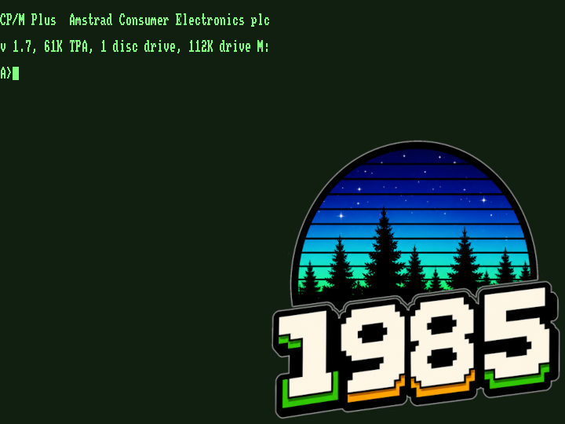
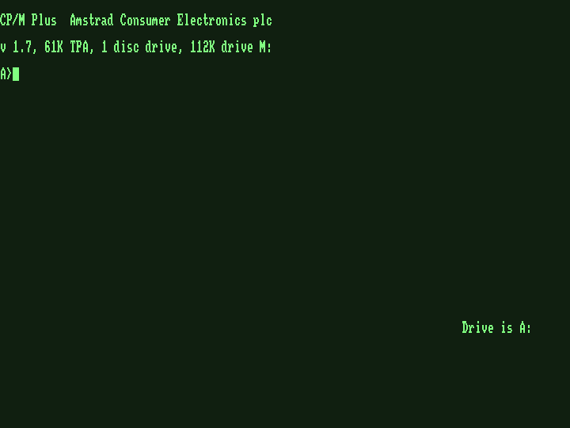
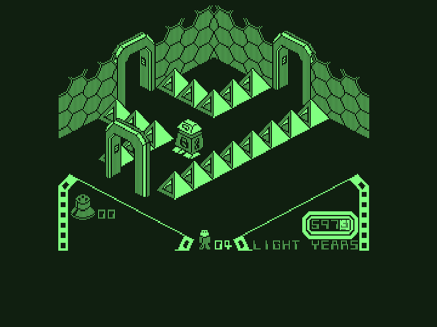
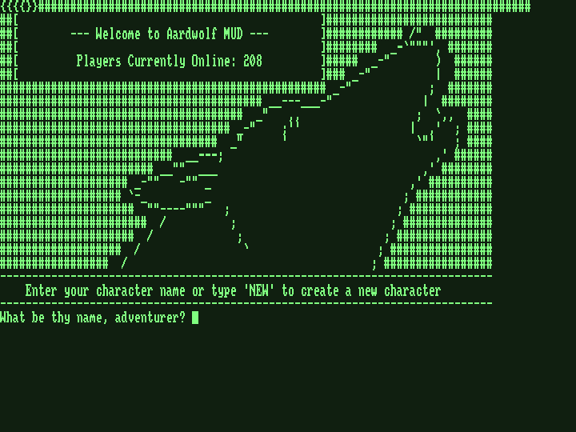

# 1985 — Amstrad PCW 8256 / 8512 / 9512 emulator



A small Amstrad PCW emulator written in C with SDL3. Sibling project
to [1984](https://github.com/salvogendut/1984) (the Amstrad CPC
emulator); the two share build system, overlay framework, and the Z80
core.

## Status

**Boots CP/M Plus.** All three reference boot disks (J11/J17/J29 CP/M
3) reach the `A>` prompt with keyboard input. The Z80 core, ASIC, uPD765A
FDC, roller-RAM video decoder, keyboard matrix, and F9 overlay are all
wired up. The CP/M+ banner correctly reports model-specific RAM size
(8256/8512/9512), drive count, and — when the PCW Backplane is plugged
in — the "SIO/Centronics add-on" too.

Models supported: **PCW 8256** (256 KB, single floppy, green monitor),
**PCW 8512** (512 KB, two floppies, green), **PCW 9512** (512 KB, two
floppies, white). Changing model or RAM in the overlay triggers a full
cold boot.

The **Second drive** option (8256 only — 8512/9512 ship with two
floppies) lives in **General**: a stock accessory that doesn't need
the backplane.

The **PCW Backplane** toggle in General is the master switch for the
Extensions tab. With it off, no hardware extensions show — pull it
and Extensions / its add-ons all reappear together.

Extensions available (Extensions tab, gated on PCW Backplane):
- **PDF printer** — host-side PDF capture for the built-in PCW
  dot-matrix printer protocol and CPS8256 Centronics bytes. Enabling it
  opens a folder chooser; each print job lands in a fresh timestamped
  `1985-print-YYYYMMDD-HHMMSS.pdf` once the printer has been idle for
  ~2 seconds. Advanced ▸ **Printer mode** flips the sink between
  **PDF** (default — file on disk) and **Real printer**, which spools
  the finalised PDF to the host's default CUPS printer via `lp` (Linux
  / macOS; Windows falls back to PDF). When Real Printer is on and the
  PDF extension is off, the print job goes through a temp file in
  `$TMPDIR` and is unlinked once `lp` has queued it. The orange LED in
  the bottom bar lights while bytes are flowing.

  On the **9512** the built-in printer is a daisywheel (chars only, no
  dot graphics), so the dot-matrix port FCh/FDh is treated as a no-op
  and the CPS8256 Centronics port is built in instead of needing the
  PCW Backplane — print jobs come through that path and remain capturable
  by the PDF / Real Printer sink. 8256 and 8512 keep the dot-matrix.
- **Serial port** — Amstrad CPS8256 (Z80-DART + 8253 baud generator +
  Centronics) at I/O ports `0xE0-0xE8`. Built into the 9512; needs the
  backplane on the 8256/8512. Host-side terminates in either a PTY
  (`/dev/pts/N`) or a TCP listener on `localhost:4002` — flip mode
  under Advanced. A split RX/TX LED next to the floppies lights when
  bytes move.
- **PerryFi** — SanPollo's Wemos D1 (ESP8266) AT modem that plugs onto
  the serial line. 1985 implements the AT command set in software
  (`AT`, `ATDT host:port`, `+++ATH`, `AT&W`, `AT$SSID=`, …) and
  forwards dial-out to a real host TCP socket. Because the host's
  network is already there, **WiFi configuration is unnecessary** —
  just enable PerryFi in the Extensions menu, fire up any CP/M
  terminal program (QTERM, KERMIT, …) at 9600 bps on the serial
  port, type `ATDT bbs.example.com:23` and you're telnetted in.
- **DK'TRONICS Sound & Joystick** — AY-3-8912 PSG + DB9 joystick port
  at I/O `0xA9-0xAB`. 1985 ships a register-accurate AY model with
  tone/noise/envelope, mixed to mono 16-bit and routed through SDL3's
  default audio device. Port A reads come from the first SDL gamepad
  the host enumerates (Atari-style: up/down/left/right + two fire
  buttons mapped to South/East).

Decorative video modes (Advanced ▸ Video mode) reinterpret the 1bpp
roller-RAM at host render time — these are ahistorical novelties (no
real PCW software drives them), ported from ZEsarUX:

- **PCW** — native 1 bpp, 720×256, monochrome with the chosen tint
  (Advanced ▸ Tint — green / amber / white).
- **CGA1** — 2 bpp, 4-colour CGA palette 0 (black / green / red /
  brown), doubled horizontally.
- **CGA2** — 2 bpp, 4-colour CGA palette 1 (black / cyan / magenta /
  white).
- **EGA** — 4 bpp, classic 16-colour IBM palette, quadrupled
  horizontally.

Snapshots — F9 ▸ Advanced ▸ **Save snapshot** / **Load snapshot**
write a `.sna` file containing the full RAM, the Z80 register set,
and the ASIC / memory-paging state. Loading a snapshot taken on a
different model triggers a cold-boot to match before restoring.
FDC command state, AY synth state, and serial / printer buffers are
not preserved — save at the `A>` prompt for safest results. CLI also
accepts `--load-sna FILE`.

Still stubbed: 9512 daisywheel fidelity, and most game-side
hardware extensions.

<p align="center">
  
  &nbsp;&nbsp;
  
</p>

<p align="center">
  <br>
  <sub><b>PerryFi AT modem — CP/M terminal software connects to a real MUD over host TCP/IP</b></sub>
</p>

## Build (Fedora)

```bash
sudo dnf install gcc make autoconf automake pkgconf-pkg-config sdl3-devel cairo-devel
autoreconf -fiv
./configure
make
./1985
```

Pass `--without-cairo` to `./configure` to drop the PDF printer
backend (useful on platforms where bundling the Cairo stack is
impractical — the printer ports still report "ready" to the guest
and the LED still blinks, but bytes don't get captured to a host
file).

## Binaries

Each push to `main` and each `v*` tag produces signed-off Linux,
Fedora RPM, and Windows builds via GitHub Actions — grab them from
the [Releases page](https://github.com/salvogendut/1985/releases).
The Windows zip is unpacked with `1985.exe`, `SDL3.dll`, and the
boot ROM next to it; double-click to launch. If anything goes
wrong on first run, look for `1985.log` in the same folder.

## Keyboard shortcuts

| Key | Action |
|-----|--------|
| F4  | Save PPM screenshot |
| F5  | Reset |
| F6  | Toggle GIF capture (auto-named in CWD) |
| F8  | Memory monitor / disassembler (own window) |
| F9  | Options overlay |
| F11 | Toggle fullscreen |
| F12 | Quit |
| Shift+F1 … Shift+F8 | PCW f1 … f8 keys |
| Ctrl+= / Ctrl+− | Step window scale 1× … 4× |
| Ctrl+V | Paste clipboard into the guest keyboard |

## Configuration

`~/.config/1985/1985.conf` is created on first run. The Advanced tab
in the overlay is hidden by default; set `tinker=true` in `[advanced]`
to expose it.

## License

GPL-2.0-only. See `LICENSE`.

## Acknowledgments

1985 is its own code, but it would not have reached a working CP/M+
boot without two existing emulators and a couple of community projects
to cross-check against:

- **[Joyce](https://www.seasip.info/Unix/Joyce/)** — John Elliott's
  long-running PCW emulator. The reference for ASIC port map,
  roller-RAM video, the keyboard matrix, the uPD765A FDC IRQ arm-delay
  logic (from its `lib765` core), and the Z80-DART / 8253 / Centronics
  model for the CPS8256 SIO add-on. Also the source of the
  authoritative `Docs/hardware.txt` and the boot-ROM bytes.
- **[ZEsarUX](https://github.com/chernandezba/zesarux)** — César
  Hernández Bañó's multi-machine Z80 emulator. Cross-checked for FDC
  IRQ delivery, printer port 0xFD semantics, F4 lock bits, and the
  expansion-port range handler. The decorative **PCW / CGA1 / CGA2 /
  EGA video modes** (Advanced ▸ Video mode) are also ported directly
  from ZEsarUX's `pcw_video_mode` — palettes and bit-grouping match
  `src/machines/pcw.c` in that project.
- **[SanPollo / PCWBackplane](https://github.com/SanPollo/PCWBackplane)**
  — modern 50-pin edge-connector hub for the original PCW range,
  modelled in 1985 as the "PCW Backplane" toggle.
- **[SanPollo / PerryFi](https://github.com/SanPollo/PerryFi)** and the
  [`PerryFiFW`](https://github.com/SanPollo/PerryFiFW) Wemos D1 firmware
  — the AT-modem command set and the dial-out semantics used by 1985's
  PerryFi extension. The firmware itself is derived from
  [mecparts/RetroWiFiModem](https://github.com/mecparts/RetroWiFiModem).
- **[DK'TRONICS Sound & Joystick (habisoft PCW wiki)](https://www.habisoft.com/pcwwiki/doku.php?id=es:hardware:perifericos:dksound)**
  — schematic / clone documentation for the AY-3-8912 + DB9 board. The
  AY model itself is ported from 1984's `src/psg.c`.

Additional documentation:

- [PCW hardware reference](https://www.seasip.info/AmstradXT/index.html)
- [systemed.net PCW pages](https://www.systemed.net/pcw/hardware.html)
- [chiark PCW I/O ports](https://www.chiark.greenend.org.uk/~jacobn/cpm/pcwports.html)
- [readerrorb.ro PCW I/O ports](https://wiki.readerrorb.ro/doku.php?id=tech:amstrad:pcw:ioports)
  — authoritative DK'tronics / AMX-mouse port table.
